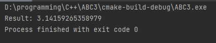
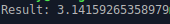
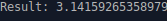

# Результаты тестов
### Программа запущена в cLion (код на C)

### Не модифицированный ассемблер код

### Модифицированный ассемблер код

### Заключенние:
В результате всех трех запусков мы получили один и тот же результат. Это значит, что проделанные модификации не повлиляи на функционал программы и она до сих пор работает корректно.
